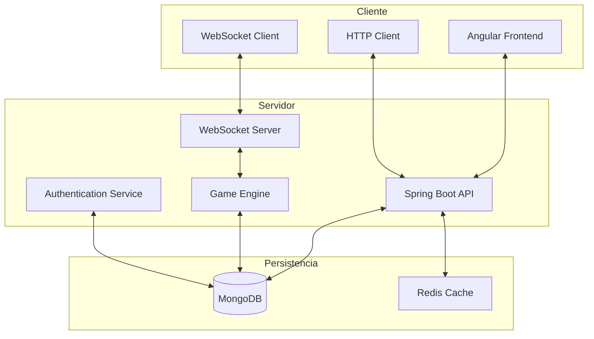
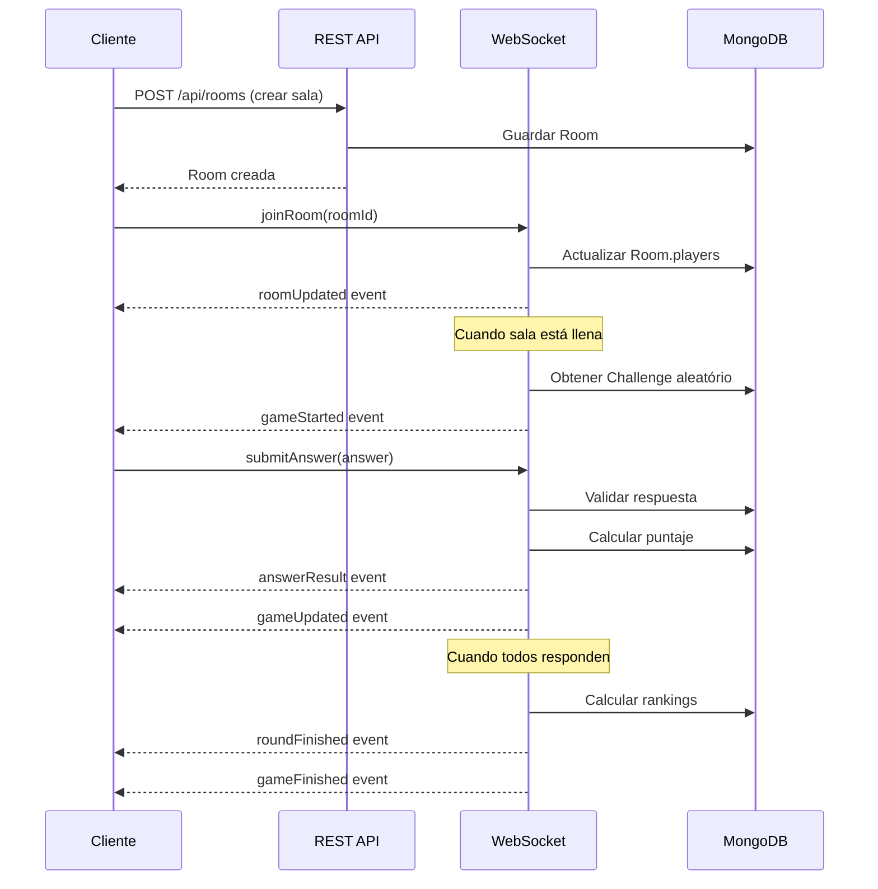

# 🏗️ Arquitectura del Sistema - Code Arena

## 📋 Visión General

Code Arena implementa una **arquitectura distribuida moderna** basada en microservicios, optimizada para comunicación en tiempo real y alta concurrencia. El sistema está diseñado para soportar múltiples partidas simultáneas con cientos de usuarios concurrentes.

---

## 🎯 Principios Arquitectónicos

### Principios Fundamentales

1. **Separación de Responsabilidades**: Frontend/Backend claramente delimitados
2. **Escalabilidad Horizontal**: Capacidad de agregar instancias según demanda
3. **Tolerancia a Fallos**: Reconexión automática y manejo de errores robusto
4. **Tiempo Real**: Comunicación bidireccional con latencia mínima
5. **Seguridad**: Autenticación JWT y validaciones en múltiples capas
6. **Mantenibilidad**: Código limpio, documentado y testeable

### Patrones Aplicados

- **MVC** (Model-View-Controller) en ambos extremos
- **Repository Pattern** para acceso a datos
- **Observer Pattern** para notificaciones en tiempo real
- **Strategy Pattern** para algoritmos de scoring
- **Factory Pattern** para creación de retos
- **Singleton Pattern** para gestión de conexiones WebSocket

---

## 🌐 Arquitectura de Alto Nivel



---

## 🖥️ Frontend - Angular Architecture

### Estructura de Componentes

```
src/app/
├── core/                    # Servicios singleton y guards
│   ├── auth/               # Autenticación y autorización
│   ├── websocket/          # Servicio WebSocket centralizado
│   └── interceptors/       # HTTP interceptors
├── shared/                 # Componentes reutilizables
│   ├── components/         # UI components compartidos
│   ├── pipes/             # Pipes personalizados
│   └── models/            # Interfaces TypeScript
├── features/              # Módulos por funcionalidad
│   ├── auth/              # Login/Register
│   ├── lobby/             # Sala de espera y lista de juegos
│   ├── game/              # Motor de juego en tiempo real
│   ├── profile/           # Perfil de usuario
│   └── rankings/          # Estadísticas y rankings
└── layouts/               # Layouts principales
```

### Servicios Principales

#### 🔌 WebSocket Service
```typescript
@Injectable({providedIn: 'root'})
export class WebSocketService {
  private socket: Socket;
  private gameState$ = new BehaviorSubject<GameState>(null);
  
  connect(token: string): Observable<boolean>
  joinRoom(roomId: string): void
  sendAnswer(answer: any): void
  disconnect(): void
}
```

#### 🎮 Game Service
```typescript
@Injectable({providedIn: 'root'})
export class GameService {
  private currentGame$ = new BehaviorSubject<Game>(null);
  
  createRoom(config: RoomConfig): Observable<Room>
  joinRoom(roomId: string): Observable<Room>
  submitAnswer(answer: Answer): Observable<Result>
  leaveRoom(): void
}
```

### State Management

- **RxJS + BehaviorSubjects** para estado reactivo
- **Services como Store** para datos compartidos
- **Local Storage** para persistencia de sesión
- **Session Storage** para datos temporales de partida

---

## ⚙️ Backend - Spring Boot Architecture

### Estructura de Capas

```
src/main/kotlin/
├── config/                 # Configuraciones
│   ├── WebSocketConfig.kt
│   ├── SecurityConfig.kt
│   └── MongoConfig.kt
├── controller/            # REST Controllers
│   ├── AuthController.kt
│   ├── GameController.kt
│   └── UserController.kt
├── websocket/            # WebSocket Handlers
│   ├── GameWebSocketHandler.kt
│   └── LobbyWebSocketHandler.kt
├── service/              # Lógica de negocio
│   ├── AuthService.kt
│   ├── GameService.kt
│   ├── UserService.kt
│   └── ChallengeService.kt
├── repository/           # Acceso a datos
│   ├── UserRepository.kt
│   ├── GameRepository.kt
│   └── ChallengeRepository.kt
├── model/               # Entidades de dominio
│   ├── User.kt
│   ├── Game.kt
│   ├── Room.kt
│   └── Challenge.kt
└── dto/                # Data Transfer Objects
    ├── requests/
    └── responses/
```

### Componentes Clave

#### 🔐 Security Configuration
```kotlin
@Configuration
@EnableWebSecurity
class SecurityConfig {
    
    @Bean
    fun filterChain(http: HttpSecurity): SecurityFilterChain {
        return http
            .cors().and()
            .csrf().disable()
            .sessionManagement().sessionCreationPolicy(STATELESS)
            .authorizeHttpRequests { auth ->
                auth.requestMatchers("/api/auth/**").permitAll()
                    .requestMatchers("/api/public/**").permitAll()
                    .anyRequest().authenticated()
            }
            .oauth2ResourceServer { oauth2 ->
                oauth2.jwt { jwt ->
                    jwt.jwtAuthenticationConverter(jwtAuthConverter())
                }
            }
            .build()
    }
}
```

#### 🎮 Game Engine Core
```kotlin
@Service
class GameService {
    
    fun createRoom(hostId: String, config: RoomConfig): Room
    fun joinRoom(roomId: String, userId: String): Room
    fun startGame(roomId: String): Game
    fun submitAnswer(gameId: String, userId: String, answer: Answer): AnswerResult
    fun calculateScores(gameId: String): List<PlayerScore>
    fun endGame(gameId: String): GameResult
}
```

#### 📡 WebSocket Handler
```kotlin
@Component
class GameWebSocketHandler : TextWebSocketHandler() {
    
    override fun afterConnectionEstablished(session: WebSocketSession) {
        // Autenticar y asociar usuario a sesión
    }
    
    override fun handleTextMessage(session: WebSocketSession, message: TextMessage) {
        // Procesar mensajes de juego en tiempo real
        when (val event = parseMessage(message)) {
            is JoinRoomEvent -> handleJoinRoom(session, event)
            is SubmitAnswerEvent -> handleSubmitAnswer(session, event)
            is LeaveRoomEvent -> handleLeaveRoom(session, event)
        }
    }
    
    override fun handleTransportError(session: WebSocketSession, exception: Throwable) {
        // Manejo de errores y reconexión
    }
}
```

---

## 🗄️ Modelo de Datos

### Esquemas MongoDB

#### User Collection
```json
{
  "_id": "ObjectId",
  "username": "string",
  "email": "string", 
  "passwordHash": "string",
  "profile": {
    "displayName": "string",
    "avatar": "string",
    "level": "number",
    "experience": "number"
  },
  "stats": {
    "gamesPlayed": "number",
    "gamesWon": "number",
    "averageScore": "number",
    "totalPlayTime": "number"
  },
  "settings": {
    "notifications": "boolean",
    "soundEnabled": "boolean",
    "theme": "string"
  },
  "createdAt": "DateTime",
  "lastLoginAt": "DateTime"
}
```

#### Game Collection
```json
{
  "_id": "ObjectId",
  "roomId": "string",
  "hostId": "ObjectId",
  "players": [{
    "userId": "ObjectId",
    "username": "string", 
    "score": "number",
    "answers": ["Answer"],
    "joinedAt": "DateTime"
  }],
  "challenges": [{
    "challengeId": "ObjectId",
    "startedAt": "DateTime",
    "duration": "number",
    "responses": ["Response"]
  }],
  "config": {
    "maxPlayers": "number",
    "difficulty": "string",
    "gameMode": "string",
    "timePerChallenge": "number"
  },
  "status": "WAITING|ACTIVE|FINISHED",
  "winner": "ObjectId",
  "createdAt": "DateTime",
  "startedAt": "DateTime",
  "finishedAt": "DateTime"
}
```

#### Challenge Collection
```json
{
  "_id": "ObjectId",
  "title": "string",
  "description": "string",
  "type": "LOGIC|MATH|PATTERN|CODE",
  "difficulty": "EASY|MEDIUM|HARD",
  "question": "string",
  "options": ["string"],
  "correctAnswer": "string",
  "explanation": "string",
  "timeLimit": "number",
  "baseScore": "number",
  "tags": ["string"],
  "createdBy": "ObjectId",
  "stats": {
    "timesUsed": "number",
    "averageTime": "number",
    "successRate": "number"
  },
  "createdAt": "DateTime"
}
```

### Índices Optimizados

```javascript
// Users
db.users.createIndex({ "email": 1 }, { unique: true })
db.users.createIndex({ "username": 1 }, { unique: true })

// Games
db.games.createIndex({ "status": 1, "createdAt": -1 })
db.games.createIndex({ "roomId": 1 }, { unique: true })
db.games.createIndex({ "players.userId": 1 })

// Challenges
db.challenges.createIndex({ "difficulty": 1, "type": 1 })
db.challenges.createIndex({ "tags": 1 })
```

---

## 🔄 Flujo de Comunicación

### Flujo típico de una partida



### Eventos WebSocket

```typescript
// Eventos Cliente → Servidor
interface ClientEvents {
  joinRoom: { roomId: string }
  leaveRoom: { roomId: string }
  submitAnswer: { answer: string, timestamp: number }
  requestHint: { challengeId: string }
  sendChatMessage: { message: string }
}

// Eventos Servidor → Cliente  
interface ServerEvents {
  roomUpdated: { room: Room }
  gameStarted: { game: Game, challenge: Challenge }
  playerJoined: { player: Player }
  playerLeft: { playerId: string }
  answerSubmitted: { playerId: string, isCorrect: boolean }
  roundFinished: { scores: PlayerScore[], nextChallenge?: Challenge }
  gameFinished: { finalResults: GameResult }
  error: { code: string, message: string }
}
```

---

## 🚀 Escalabilidad y Performance

### Estrategias de Escalabilidad

#### Horizontal Scaling
- **Load Balancer** (NGINX) distribuyendo tráfico
- **Múltiples instancias** de Spring Boot
- **Session Sticky** para WebSocket connections
- **MongoDB Sharding** por región geográfica

#### Caching Strategy
```kotlin
@Service
class CacheService {
    
    @Cacheable("challenges")
    fun getChallengesByDifficulty(difficulty: Difficulty): List<Challenge>
    
    @Cacheable("user-stats")
    fun getUserStats(userId: String): UserStats
    
    @CacheEvict("user-stats")
    fun updateUserStats(userId: String, stats: UserStats)
}
```

#### Database Optimization
- **Read Replicas** para consultas pesadas
- **Índices compuestos** para queries frecuentes
- **Agregación pipelines** optimizados
- **Connection pooling** configurado

### Métricas de Performance

| Métrica | Objetivo | Crítico |
|---------|----------|---------|
| Latencia WebSocket | < 50ms | < 100ms |
| Tiempo respuesta API | < 200ms | < 500ms |
| Usuarios concurrentes | 1000+ | 500+ |
| Uptime | 99.9% | 99.5% |
| Memoria por instancia | < 1GB | < 2GB |

---

## 🔒 Seguridad

### Autenticación y Autorización

```kotlin
// JWT Token Structure
data class JwtToken(
    val sub: String,           // User ID
    val username: String,      // Username
    val roles: List<String>,   // User roles
    val iat: Long,            // Issued at
    val exp: Long             // Expiration
)
```

### Medidas de Seguridad

1. **JWT Tokens** con expiración de 24h
2. **Refresh Tokens** para renovación automática
3. **Rate Limiting** en APIs críticas
4. **CORS** configurado específicamente
5. **WebSocket Authentication** en cada conexión
6. **Input Validation** en todos los endpoints
7. **SQL Injection Prevention** (NoSQL pero validación estricta)
8. **XSS Protection** en frontend

### Rate Limiting Configuration

```kotlin
@Component
class RateLimitingFilter : OncePerRequestFilter() {
    
    private val limiter = RateLimiter.create(100.0) // 100 req/sec
    
    override fun doFilterInternal(
        request: HttpServletRequest,
        response: HttpServletResponse, 
        filterChain: FilterChain
    ) {
        if (!limiter.tryAcquire()) {
            response.status = 429
            return
        }
        filterChain.doFilter(request, response)
    }
}
```

---

## 📊 Monitoreo y Observabilidad

### Logging Strategy

```kotlin
@Component
class GameEventLogger {
    
    private val logger = LoggerFactory.getLogger(GameEventLogger::class.java)
    
    fun logGameCreated(game: Game) {
        logger.info("Game created: gameId=${game.id}, hostId=${game.hostId}")
    }
    
    fun logPlayerAction(gameId: String, playerId: String, action: String) {
        logger.info("Player action: gameId=$gameId, playerId=$playerId, action=$action")
    }
}
```

### Health Checks

```kotlin
@Component
@ConditionalOnProperty("management.health.custom.enabled")
class GameServiceHealthIndicator : HealthIndicator {
    
    override fun health(): Health {
        return try {
            val activeGames = gameService.getActiveGamesCount()
            val connectedUsers = webSocketService.getConnectedUsersCount()
            
            Health.up()
                .withDetail("activeGames", activeGames)
                .withDetail("connectedUsers", connectedUsers)
                .build()
        } catch (e: Exception) {
            Health.down(e).build()
        }
    }
}
```

---

## 🧪 Testing Strategy

### Pyramid de Testing

```
    /\
   /  \     E2E Tests (10%)
  /____\    Integration Tests (20%)  
 /______\   Unit Tests (70%)
```

### Test Configuration

```kotlin
@SpringBootTest(webEnvironment = SpringBootTest.WebEnvironment.RANDOM_PORT)
@TestPropertySource(properties = ["spring.data.mongodb.database=test-db"])
class GameServiceIntegrationTest {
    
    @Test
    fun `should create game room successfully`() {
        // Given
        val hostId = "user123"
        val config = RoomConfig(maxPlayers = 4, difficulty = MEDIUM)
        
        // When
        val room = gameService.createRoom(hostId, config)
        
        // Then
        assertThat(room.hostId).isEqualTo(hostId)
        assertThat(room.config.maxPlayers).isEqualTo(4)
    }
}
```

---

## 📦 Deployment Architecture

### Containerización

```dockerfile
# Backend Dockerfile
FROM openjdk:21-jre-slim
COPY build/libs/code-arena-*.jar app.jar
EXPOSE 8080
ENTRYPOINT ["java", "-jar", "/app.jar"]
```

### Docker Compose (Desarrollo)

```yaml
version: '3.8'
services:
  backend:
    build: .
    ports:
      - "8080:8080"
    environment:
      - MONGODB_URL=mongodb://mongo:27017/codearena
      - REDIS_URL=redis://redis:6379
    depends_on:
      - mongo
      - redis
      
  mongo:
    image: mongo:7
    ports:
      - "27017:27017"
    volumes:
      - mongo-data:/data/db
      
  redis:
    image: redis:7-alpine
    ports:
      - "6379:6379"
```

---

## 🔮 Futuras Mejoras

### Roadmap Técnico

**Sprint 4+:**
- Microservicios separados (User Service, Game Service, Notification Service)
- Event Sourcing para historial completo de partidas
- CQRS para separar lecturas y escrituras
- GraphQL API para queries complejas
- Machine Learning para recomendación de retos

**Optimizaciones:**
- CDN para assets estáticos
- Server-Side Rendering (SSR) completo
- Progressive Web App (PWA)
- WebAssembly para algoritmos pesados
- Kubernetes para orquestación

---

*Arquitectura diseñada para Code Arena - Escuela Colombiana de Ingeniería - ARSW 2024-I*
